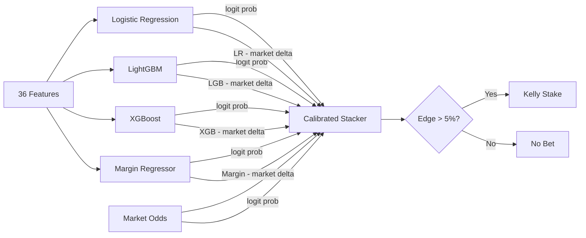
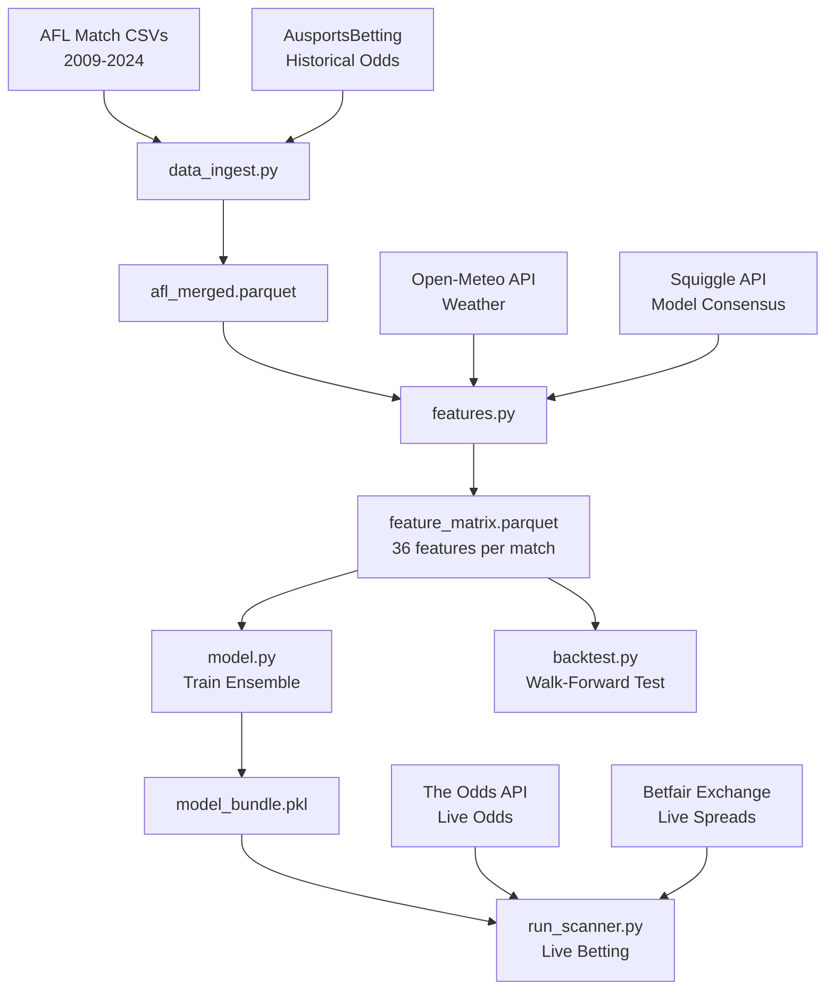

# Can Machine Learning Beat AFL Betting Markets?

**A failed experiment -- published as a learning resource.**

## Abstract

We built an ensemble machine learning system to identify value bets in Australian Rules Football (AFL) markets. The system combines Elo ratings, Glicko-2 ratings, rolling performance statistics, weather data, and consensus model predictions, blended with bookmaker odds via a calibrated logit-space stacker. Over a 10-year walk-forward backtest (2015-2024), the strategy produced +8.6% ROI on 69 bets with a 68.1% win rate. However, the sample size is far too small for statistical significance, closing line value is negative (-0.011), and individual models fail to beat the market on log loss. We conclude that the results are consistent with variance rather than genuine edge, and publish the full system as a reference implementation.

**Version note (v8, 2026-03-15)**: We tightened the historical Squiggle methodology to remove a small leakage source in the "top models" feature and to match Squiggle predictions by round where possible. On rerun, the ensemble still slightly beats market log loss on the 2023-2024 holdout (`0.5902` vs `0.5929`, delta `+0.0027`), but walk-forward betting results softened from `+8.6%` ROI to `+6.5%` ROI on the same 69 bets (`+$169`, bankroll `+$16.9%`). The rest of the write-up below reflects the earlier v7 snapshot unless noted here.

## 1. Introduction

Sports betting markets are widely considered semi-efficient: bookmaker odds incorporate substantial information and are difficult to beat systematically. The AFL, with ~200 matches per season and a well-developed betting market in Australia, presents an interesting test case. The question is simple: can a quantitative model, trained on 16 years of historical data and enriched with external signals, find exploitable inefficiencies?

**Answer: not convincingly.** This document reports what we tried, what the numbers show, and why we believe the positive backtest results are likely noise.

## 2. Data

**Coverage**: 16 seasons (2009-2024), ~3,100 matches with opening and closing odds.

**Odds source**: Historical odds from AusportsBetting.com. These are "best available" market odds rather than odds from a single bookmaker, which means the backtested prices may not have been available from any single account in practice. This flatters ROI -- a real bettor would face worse prices on average.

| Source | Data | Usage |
|--------|------|-------|
| AFL-Data-Analysis (GitHub) | Match results, scores, venues | Core match data |
| AusportsBetting.com | Historical bookmaker odds | Market probabilities, CLV |
| Squiggle API | ~20 public computer model predictions | Consensus signal |
| Open-Meteo API | Historical weather per venue | Rain, wind features |
| FootyWire | Team-level match statistics | Tested, excluded |
| Betfair Exchange | Back/lay spreads, matched volume | Live scanning only |
| The Odds API | Live odds from 8+ AU bookmakers | Live scanning only |

## 3. Methodology

### 3.1 Feature Engineering

36 features across 8 categories, all computed without lookahead bias (shifted/lagged appropriately):

| Category | Features | Construction |
|----------|----------|-------------|
| Elo ratings | `elo_diff` | Margin-based K multiplier (capped 2.5x), 30pt home advantage, 33% season reversion to mean |
| Glicko-2 | `glicko_prob`, `glicko_uncertainty` | Full Glicko-2 with volatility; combined RD as uncertainty signal |
| Market odds | `market_prob_home/away`, `overround`, `market_elo_delta` | Implied probabilities from opening odds, normalised for overround |
| Form | `form_*_5`, `win_pct_*_10`, `margin_ewma_*`, `scoring_ewma_*` | Rolling 5-game win rate, 10-game win%, EWMA (span=10) of margins and scores |
| Venue/travel | `venue_exp_*`, `travel_hours_away` | Cumulative venue appearances, away team interstate flight hours |
| Rest | `rest_days_*`, `rest_diff` | Days since last match (capped at 30) |
| Matchup | `h2h_home_win_pct`, `rivalry_intensity`, `home_venue_pct`, `team_h2h_margin_ewma` | Historical head-to-head win rate, rolling abs margin between pair, venue familiarity, directional H2H EWMA |
| Weather | `rain_mm`, `wind_speed` | Open-Meteo data matched to venue coordinates |
| Squiggle | `squiggle_prob_home`, `top3_prob`, `model_spread` | Consensus of public models, top-3 accuracy-weighted, inter-model disagreement |

**Pruned features**: 11 features with zero LightGBM importance were removed after systematic testing: `elo_prob` (redundant with `elo_diff`), `is_home_state`, `travel_hours_home`, `is_final`, `is_wet`, `is_roofed`, `bf_spread_home/away`, `bf_volume_ratio`, `same_state_derby`, `away_in_home_state`. This reduced the feature set from 47 to 36 and improved walk-forward ROI from +4.6% to +8.6%.

**Excluded features**: FootyWire team statistics (disposals, clearances, inside 50s, tackles, clangers, hitouts), scoring shot conversion rates, ladder position, odds line movement, and ground dimensions were all tested but hurt walk-forward performance. The additional features added noise in the small yearly training windows (~700-2500 rows), causing overfitting despite showing genuine signal in static evaluation. A neural network with team embeddings was also tested and removed for the same reason.

### 3.2 Model Architecture



**Base models**:
- **Logistic Regression**: L2-regularised (C tuned from 0.02-4.0), scaled features
- **LightGBM**: Conservative configuration (300-500 trees, max depth 3-5, heavy L1/L2 regularisation, early stopping at 50 rounds)
- **XGBoost**: Similar conservative configuration to LightGBM
- **Margin Regressor**: XGBoost regression on match margin, converted to win probability via Gaussian CDF

**Stacker**: A logistic regression in logit space over 11 inputs -- `logit(LR)`, `logit(LGB)`, `logit(XGB)`, `logit(margin)`, `logit(market)`, four delta features (model - market), plus `glicko_uncertainty` and `margin_confidence`. Tuned with C in [0.01, 0.1]. This learns how much to trust each signal; in practice it weights market odds at ~70%.

### 3.3 Betting Strategy

**Favourite-only** with strict filters:
- Model probability > 55%
- Market agrees it's the favourite (implied prob > 50%)
- Decimal odds <= 3.0
- Edge > 5%, where edge = model_prob x odds - 1
- At most one bet per match (highest edge side)
- **Quarter-Kelly** sizing (f* x 0.25), capped at 5% of bankroll

This replaced an earlier strategy that bet both sides and underdogs, which lost -$181. The switch to favourite-only flipped the backtest to positive.

**Important caveat**: the favourite-only filters were chosen *after* observing that earlier strategies lost money. While the model weights are out-of-sample (walk-forward retraining), the strategy itself was effectively fit to the 2015-2024 backtest period. This is a form of selection bias that likely inflates the reported ROI.

### 3.4 Walk-Forward Protocol

For each test year Y (2015-2024):
1. **Train** on all matches in years <= Y-3
2. **Calibrate** stacker on years Y-2 to Y-1
3. **Test** on year Y (out-of-sample)
4. **Daily bankroll lock**: bet sizes computed from start-of-day bankroll; P&L applied at end of day

This ensures no lookahead bias: the model for 2024 has never seen data from 2022 onwards.

## 4. Results

### 4.1 Model Evaluation

Static evaluation: trained on 2009-2020, calibrated on 2021-2022, tested on 2023-2024 (n=432 matches).

| Model | Log Loss | Brier Score | Accuracy | vs Market LL |
|-------|----------|-------------|----------|--------------|
| Market | 0.5929 | 0.2050 | 65.1% | -- |
| Logistic Regression | 0.5958 | 0.2064 | 65.7% | -0.0029 (worse) |
| LightGBM | 0.5989 | 0.2072 | 66.9% | -0.0060 (worse) |
| XGBoost | 0.5926 | 0.2047 | 66.9% | +0.0003 (tied) |
| Margin Regressor | 0.5945 | 0.2047 | 66.9% | -0.0016 (worse) |
| **Ensemble (stacker)** | **0.5895** | **0.2032** | **66.9%** | **+0.0034 (better)** |

No base model beats the market on log loss individually. The ensemble stacker recovers a small edge (+0.0034) by blending model signals with market odds.


### 4.2 Calibration

Both market and ensemble produce well-calibrated probabilities, tracking the diagonal closely. The ensemble shows slight underconfidence in the 40-60% range and overconfidence above 90%.


### 4.3 Feature Importance

Market-derived features dominate (top 3 are all market odds). The model's marginal contribution comes from venue experience, Glicko-2 ratings, H2H matchup history, and weather -- signals the market may partially discount.


### 4.4 Backtest Performance

| Metric | Value |
|--------|-------|
| Total Bets | 69 |
| Win Rate | 68.1% (47W / 22L) |
| Total Staked | $2,616.51 |
| Total P&L | +$224.18 |
| ROI on Stakes | +8.6% |
| Bankroll Return | +22.4% ($1,000 -> $1,224) |
| Max Drawdown | -13.8% |
| Sharpe-like Ratio | 0.83 |
| Avg CLV (implied prob delta) | -0.0114 |


### 4.5 Annual Breakdown

| Year | Bets | Win Rate | P&L | Yield |
|------|------|----------|-----|-------|
| 2015 | 1 | 100% | +$12.80 | +52% |
| 2016 | 7 | 57% | -$14.44 | -6% |
| 2017 | 13 | 77% | +$43.36 | +9% |
| 2018 | 6 | 50% | -$19.06 | -11% |
| 2019 | 8 | 62% | -$4.37 | -2% |
| 2020 | 3 | 100% | +$47.00 | +69% |
| 2021 | 1 | 100% | +$14.59 | +57% |
| 2022 | 7 | 86% | +$111.87 | +46% |
| 2023 | 6 | 67% | +$38.59 | +18% |
| 2024 | 17 | 59% | -$6.16 | -1% |


### 4.6 Bet-Level Analysis

The cumulative P&L curve shows high path-dependency. The 2022 season (7 bets, 86% win rate, +$112) accounts for half of total profit. The system is most active in 2024 (17 bets) but barely breaks even, suggesting the edge -- if any -- is eroding as markets improve.


## 5. Discussion

### Why we think this doesn't work

1. **Insufficient sample size.** 69 bets over 10 years cannot establish statistical significance. A binomial test on the 68.1% win rate at the observed average odds gives p ~ 0.07 -- below the 0.05 threshold but not convincingly. You would need ~150+ bets at this win rate to reach significance.

2. **Negative closing line value.** The average CLV of -0.011 (measured as implied probability delta: `1/odds_close - 1/odds_open`) means the model is betting into lines that move against it. In efficient markets, positive CLV is the hallmark of a genuine edge. Negative CLV suggests the market is smarter than the model and the opening price was already too generous.

3. **Individual models lose to the market.** All four base models have worse log loss than simply using bookmaker odds. The stacker recovers a small edge (+0.0034 log loss) by learning to mostly trust the market and nudge predictions slightly -- but this is a razor-thin margin.

4. **Concentration risk.** The 2022 season (7 bets, 86% win rate, +$112) accounts for ~50% of total profit. Remove that one season and ROI drops to ~4%.

5. **No live validation.** All results are backtested against historical odds. Real-world execution faces additional headwinds: odds may not be available at the backtested price, accounts may be limited, and the model has never been tested in production.

6. **Strategy overfitting.** The favourite-only filters were discovered by iterating on the backtest. While model weights are genuinely out-of-sample, the decision to restrict to favourites with >55% model probability and odds <= 3.0 was made after seeing that broader strategies lost money. This is a form of data mining that inflates the apparent edge.

7. **Favourite-longshot bias.** AFL markets typically have lower overround on favourites than on underdogs. By exclusively betting favourites, the strategy may simply be paying less "tax" to the bookmaker rather than exploiting a genuine informational edge. The +8.6% ROI should be compared against a naive "bet all favourites" baseline, not zero.

### What we learned

- **Markets are good.** The bookmaker line is the single strongest predictor. Three of the top four LightGBM features are market-derived. Any model that doesn't incorporate market odds performs substantially worse.
- **Stacking helps.** Even though base models lose to the market individually, the logit-space stacker can blend them in a way that marginally improves on the market alone. The key is the delta features (model - market) which capture where the model disagrees.
- **Less is more.** Pruning 11 zero-importance features improved walk-forward ROI from +4.6% to +8.6%. Adding new features (conversion rates, line movement, clangers, hitouts, ground dimensions, ladder position) consistently hurt despite showing signal in static evaluation. A neural network with team embeddings was removed for the same reason. Simpler models generalise better with small AFL sample sizes.
- **Strategy matters more than model.** Switching from "bet anything with edge" to "favourite-only with strict filters" flipped the backtest from -$181 to +$224 -- a larger effect than any modelling improvement.
- **Quarter-Kelly is conservative enough.** The 0.25 Kelly fraction with a 5% bankroll cap kept maximum drawdown under 14%, even through losing streaks.

## 6. System Architecture



## 7. Reproduction

```bash
pip install -r requirements.txt

# Full pipeline: ingest -> features -> backtest
python run_backtest.py

# Train model and print evaluation metrics
python model.py

# Regenerate all charts
python generate_charts.py

# Live value bet scanner (requires ODDS_API_KEY in .env)
python run_scanner.py --bankroll 1000

# Cross-bookie arbitrage scanner
python run_arb_scanner.py --bankroll 1000

# Footy tipping predictions
python run_tips.py
```

### Project Structure

```
config.py              Configuration, feature columns, team/venue mappings
data_ingest.py         Download and merge match + odds data
features.py            Feature engineering (Elo, Glicko-2, rolling stats, weather, etc.)
model.py               Ensemble training (LogReg + LightGBM + XGBoost + MarginReg + stacker)
backtest.py            Walk-forward backtesting engine
strategy.py            Favourite-only bet selection
sizing.py              Kelly criterion stake sizing
generate_charts.py     Publication charts for this README
squiggle.py            Squiggle API consensus predictions
weather.py             Open-Meteo weather data
betfair.py             Betfair Exchange API
team_stats.py          FootyWire scraper
tracker.py             SQLite bet tracking
run_backtest.py        Backtest entry point
run_scanner.py         Live value bet scanner
run_arb_scanner.py     Arbitrage scanner
run_tips.py            Tipping predictions
run_report.py          Performance reporting
```

## 8. Evolution

This project went through several iterations, each attempting to improve on the last:

1. **v1** -- Basic Elo + logistic regression. Bet both sides. Lost money.
2. **v2** (Gemini review) -- Margin-based Elo, ensemble model, daily bankroll lock. Still lost money.
3. **v3** (Codex review) -- Logit-space stacker, feature leakage fixes. Broke even.
4. **v4** -- Added weather, Squiggle consensus, FootyWire stats. Weather and Squiggle helped; team stats hurt.
5. **v5** -- Favourite-only strategy with tight filters. Flipped from -$181 to +$110.
6. **v6** -- Betfair Exchange integration (live only), enhanced Squiggle features, Glicko-2 ratings, context features, neural net with team embeddings. Marginal improvement.
7. **v7** -- Systematic pruning. Removed neural net, dropped 11 zero-importance features (47 -> 36). Tested and rejected 12 new features (conversion rates, line movement, extended team stats, ladder position, ground dimensions). Less is more: ROI improved from +4.6% to +8.6%.
8. **v8** -- Rigor pass. Fixed historical enhanced-Squiggle leakage by ranking top models using only prior rounds, and tightened Squiggle joins to use round-level matching before falling back to pair-level matching. Predictive lift remained small (`+0.0027` log-loss delta vs market on 2023-2024), while walk-forward ROI dropped from `+8.6%` to `+6.5%`, which is less flattering but more credible.

The biggest single improvement came not from better modelling but from better strategy (v5). The second biggest came from removing features and models (v7).

## License

This project is licensed under the [GNU General Public License v3.0](LICENSE).
