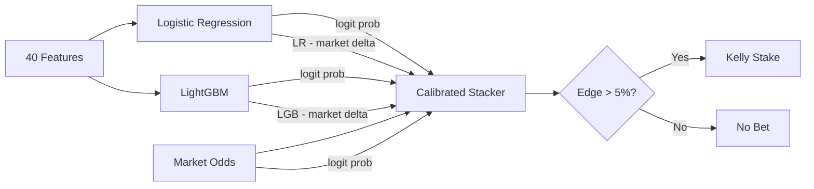
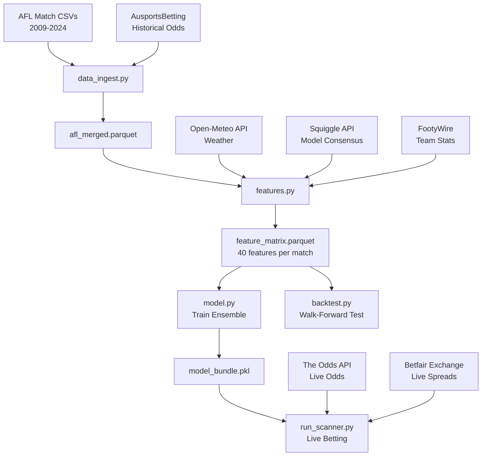

# AFL Value Betting Experiment (Failed)

A failed experiment in building a machine learning system to beat AFL betting markets. Published as a learning resource.

The system combines Elo ratings, rolling form statistics, weather data, and consensus model predictions into an ensemble that blends its own signal with market odds via a calibrated stacker. After months of iteration it produces a backtest that looks marginally profitable -- but the evidence is too thin to trust.

## The Question

Can a quantitative model identify profitable betting opportunities in AFL markets, where bookmaker odds already encode significant information?

**Answer: Not convincingly.** The model ekes out a +0.0012 log loss edge over the market across 432 test matches, and the backtest shows +8.4% ROI -- but on only 43 bets over 10 years. That's noise, not signal.

## Approach

### Data

- **16 seasons** of AFL match data (2009-2024), ~3,100+ matches with odds
- Sources: AFL-Data-Analysis (GitHub), AusportsBetting.com historical odds, Squiggle API, Open-Meteo weather API, FootyWire team statistics

### Feature Engineering (40 features)

| Category | Features | Notes |
|----------|----------|-------|
| **Elo ratings** | `elo_diff`, `elo_prob` | Margin-based K multiplier (capped at 2.5x), 30pt home advantage, 33% season reversion |
| **Market odds** | `market_prob_home/away`, `market_overround`, `market_elo_delta` | Implied probabilities from opening odds |
| **Form** | `form_*_5`, `win_pct_*_10`, `margin_ewma_*`, `scoring_ewma_*` | Rolling 5-game form, 10-game win%, EWMA trends |
| **Venue/travel** | `venue_exp_*`, `is_home_state`, `travel_hours_*` | Venue familiarity, interstate travel costs |
| **Rest** | `rest_days_*`, `rest_diff` | Days between games |
| **Matchup** | `h2h_home_win_pct` | Historical head-to-head record |
| **Weather** | `rain_mm`, `wind_speed`, `is_wet`, `is_roofed` | Open-Meteo historical data per venue |
| **Squiggle consensus** | `squiggle_prob_home`, `squiggle_top3_prob`, `squiggle_model_spread` | Average of ~20 public computer models, top-3 accuracy-weighted, model disagreement |
| **Betfair Exchange** | `bf_spread_home/away`, `bf_volume_ratio` | Live only (neutral defaults in backtest) |

Team-level FootyWire statistics (disposals, clearances, inside 50s, tackles) were tested but **excluded** -- they added noise and reduced accuracy by 0.4%.

### Model Architecture

**Ensemble with calibrated logit-space stacking:**

1. **Logistic Regression** -- tuned regularization (C: 0.02-4.0), scaled features
2. **LightGBM** -- conservative config (300-500 trees, max depth 3-5, heavy regularization)
3. **Calibrated Stacker** -- logistic regression on 5 features:
   - `logit(LogReg prob)`, `logit(LightGBM prob)`, `logit(market prob)`
   - `LGB - market` delta, `LR - market` delta

The stacker learns how much to trust the models vs the market. In practice it heavily weights market odds (~70%) and blends in model signals where they disagree.



### Betting Strategy

**Favourite-only** with strict filters:
- Model probability > 55%
- Market agrees it's the favourite (implied prob > 50%)
- Odds <= 3.0
- Edge > 5% (model_prob * odds - 1)
- At most one bet per match (highest edge side)
- **Quarter-Kelly** sizing, capped at 5% of bankroll per bet

This replaced an earlier strategy that bet both sides and underdogs -- which lost money.

## Results

### Model Accuracy (Static Evaluation)

Trained on 2009-2020, calibrated on 2021-2022, tested on 2023-2024:

| Model | Test Log Loss | Test Accuracy | vs Market LL |
|-------|--------------|---------------|--------------|
| **Market** | 0.5929 | 65.1% | -- |
| **LogReg** | 0.5990 | 65.5% | -0.0061 (worse) |
| **LightGBM** | 0.6023 | 68.3% | -0.0094 (worse) |
| **Ensemble** | **0.5916** | **66.2%** | **+0.0012 (better)** |

The individual models can't beat the market on log loss alone. The ensemble stacker marginally beats it (+0.0012 log loss edge) by learning which situations to trust its own signal vs the market.

### Walk-Forward Backtest (2015-2024)

Yearly retrain: train on years <= Y-3, calibrate on Y-2 to Y-1, test on year Y.

| Metric | Value |
|--------|-------|
| **Total Bets** | 43 |
| **Win Rate** | 67.4% |
| **Total Staked** | $1,312.78 |
| **Total P&L** | +$110.17 |
| **ROI on Stakes** | +8.4% |
| **Bankroll Return** | +11.0% ($1,000 -> $1,110) |
| **Max Drawdown** | -10.9% |
| **Sharpe-like** | 0.71 |
| **Avg CLV** | -0.0080 |

### Year-by-Year

| Year | Bets | Win Rate | P&L | Yield |
|------|------|----------|-----|-------|
| 2015 | 8 | 75% | +$19.56 | +7% |
| 2016 | 5 | 60% | -$12.86 | -10% |
| 2017 | 2 | 50% | -$10.57 | -23% |
| 2018 | 3 | 67% | +$7.58 | +12% |
| 2019 | 8 | 62% | +$14.77 | +6% |
| 2020 | 0 | -- | $0.00 | -- |
| 2021 | 2 | 100% | +$27.99 | +56% |
| 2022 | 1 | 100% | +$17.72 | +53% |
| 2023 | 6 | 67% | +$24.15 | +13% |
| 2024 | 8 | 62% | +$21.83 | +8% |

### Bankroll Curve


### Calibration

The ensemble calibration closely tracks the diagonal (well-calibrated), with slight overconfidence at the extreme ends:


### Feature Importance (LightGBM)

Top 10 features by split importance:

1. `market_prob_home` (220) -- Market odds dominate
2. `market_overround` (185) -- Bookmaker margin signal
3. `market_prob_away` (182)
4. `venue_exp_diff` (150) -- Venue familiarity matters
5. `margin_ewma_home` (136) -- Recent scoring margins
6. `wind_speed` (124) -- Weather affects play style
7. `scoring_ewma_away` (120)
8. `margin_ewma_away` (112)
9. `market_elo_delta` (108) -- Where Elo disagrees with market
10. `elo_diff` (107) -- Raw Elo rating gap

Notable: Betfair Exchange features, `is_final`, `travel_hours_home`, and `is_home_state` had zero importance (all historical values are defaults for Betfair/Exchange features).

## Honest Assessment

**What works:**
- The ensemble stacker does beat the market on log loss, but barely (+0.0012)
- The favourite-only strategy with tight filters produces a positive ROI (+8.4%) over 10 years
- Calibration is good -- predicted probabilities are reliable
- The system correctly identifies that market odds are the strongest signal and uses models as a supplement, not a replacement

**What doesn't work / concerns:**
- **Tiny sample size**: 43 bets over 10 years is not statistically significant. A few lucky bets in 2021-22 (3 bets, 100% win rate, +$46) substantially flatter the results
- **Negative CLV (-0.008)**: The model is betting into lines that move against it on average. This suggests the model may not have a genuine informational edge -- the wins could be variance
- **Individual models lose to the market**: LogReg and LightGBM both have worse log loss than the market baseline. Only the stacker's blending recovers a tiny edge
- **COVID year gap**: Zero bets in 2020 (shortened season) creates a survivorship gap
- **No live track record**: All results are backtested. Transaction costs, odds availability, and execution slippage in live betting could easily erase an 8% edge
- **Betfair/Exchange features are dead weight**: Historical defaults (0.05 spread, 0.5 volume) mean these features contribute nothing in backtesting

**Bottom line**: The model is well-built and the favourite-only strategy avoids the biggest traps (betting underdogs, chasing long odds). But 43 bets at +8.4% ROI is not enough evidence to conclude there's a real edge vs lucky variance. You'd need several hundred bets to have statistical confidence.

## Evolution

The project went through several iterations (see git log):

1. **Initial build** -- Basic Elo + logistic regression
2. **Gemini review** -- Added margin-based Elo, ensemble model, daily bankroll lock
3. **Codex review** -- Ensemble stacker, feature leakage fixes, logit-space blending
4. **Weather/Squiggle/team stats** -- External data sources (weather and Squiggle improved results; team stats did not)
5. **Favourite-only strategy** -- Replaced losing underdog-heavy strategy; flipped P&L from -$181 to +$110
6. **Betfair Exchange** -- Added live exchange data (useful for scanning, not backtest)
7. **Enhanced Squiggle** -- Top-3 model averaging and model disagreement features

## Data Pipeline



## Usage

```bash
# Install dependencies
pip install -r requirements.txt

# Full pipeline: ingest -> features -> backtest
python run_backtest.py

# Train model and see evaluation metrics
python model.py

# Live value bet scanner (requires ODDS_API_KEY in .env)
python run_scanner.py --bankroll 1000

# Cross-bookie arbitrage scanner
python run_arb_scanner.py --bankroll 1000

# Footy tipping predictions
python run_tips.py
```

## Project Structure

```
config.py              Configuration, feature columns, team/venue mappings
data_ingest.py         Download and merge match + odds data
features.py            Feature engineering (Elo, rolling stats, weather, etc.)
model.py               Ensemble training (LogReg + LightGBM + stacker)
backtest.py            Walk-forward backtesting engine
strategy.py            Favourite-only bet selection
sizing.py              Kelly criterion stake sizing
squiggle.py            Squiggle API consensus predictions
weather.py             Open-Meteo weather data
betfair.py             Betfair Exchange API
team_stats.py          FootyWire scraper
tracker.py             SQLite bet tracking
run_backtest.py        Backtest entry point
run_scanner.py         Live value bet scanner
run_arb_scanner.py     Arbitrage scanner
run_tips.py            Tipping predictions
run_report.py          Performance reporting
```

## License

This project is licensed under the [GNU General Public License v3.0](LICENSE).
